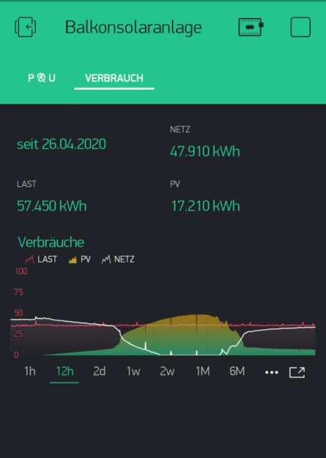
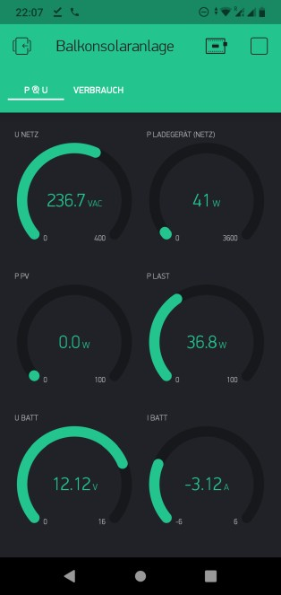
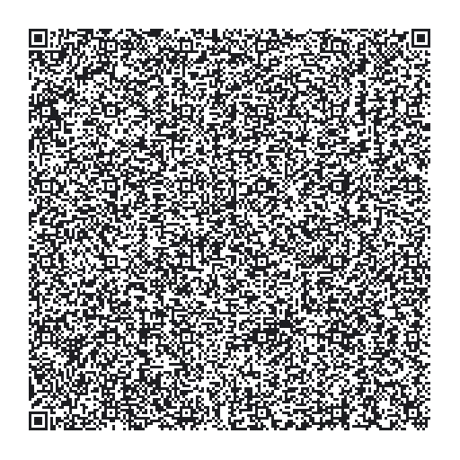

# Energymetering your home and solar with Blynk
using an HIKING DDS238-2 ZN/S energy meter for the mains and a EPEVER TRACER A/B-Series charge controller for your solar - Communication through Modbus over RS-485 by ESP8266

 

### Resources / Credits to
support forum on the Blynk community forums: https://community.blynk.cc/t/epsolar-tracer-2210a-charge-controller-blynk-epic-solar-monitor/10596

jaminNZx on GitHub: https://github.com/jaminNZx/Tracer-RS485-Modbus-Blynk

tekk on GitHub: https://github.com/tekk/Tracer-RS485-Modbus-Blynk-V2

### Hardware
* EPEVER Tracer A/B-Series Solar Charge Controller
* HIKING DDS238-2 ZN/S Mains Energy Meter 
* TTL-to-RS232-Converter
* RS485 UART Module (with automatic flow control 74HC04 - not the MAX485 chip!)
* ESP8266 Dev Board (NodeMCU)
* An old ethernet cable with RJ45 connector to cut open

### Software
* either the blynk.io Cloud version or a self hosted instance of [Blynk Server](https://github.com/blynkkk/blynk-server)
* [Blynk](http://www.blynk.cc/) Mobile App ([iOS](https://apps.apple.com/us/app/blynk-iot-for-arduino-rpi/id808760481) & [Android](https://play.google.com/store/apps/details?id=cc.blynk&hl=en))
* Blynk App Project sketch (you can use the QR-Code to clone mine)
* Arduino IDE 1.8.7+
* Arduino Project sketch files (ESP8266_DDS238_TRACER_Modbus_Blynk.ino, settings.h)
* Terminal Software like puTTY to show Serial Data

### Wiring
#### Wiring RS485 UART Module (with automatic flow control 74HC04) to ESP8266
I recommend putting a 2-pole switch to disconnect TX and RX while uploading code, although for me it works just removing RX
|Module | ESP8266          | 
|-------|------------------|
| Vcc   | Vin (5V)         | 
| TX    | TX0 (D1 - GPIO1) |
| RX    | RX0 (D3 - GPIO3) |
| GND   | GND (G - GND)    |

#### Wiring RS485 UART Module to HIKING DDS238 & EPEVER TRACER
Cut open your ethernet cable and split out pins 3/4, 5/6, 7/8 (B, A, GND)
| Signal | DDS238           | TRACER              |
|--------|------------------|---------------------|
|   A+   | Clamp 8 (RS485A) | RJ45 Pins 5+6 (A+)  |
|   B-   | Clamp 7 (RS485B) | RJ45 Pins 3+4 (B-)  |
|  GND   |  n.c.            | RJ45 Pins 7+8 (GND) |

#### Wiring TTL-to-RS232-Converter (for output of debug console) to ESP8266
|Converter | ESP8266          | 
|----------|------------------|
| RX       | TX1 (D4 - GPIO4) | 
| GND      | GND (G - GND)    |

## Setup

### Libraries
* ESP8266 Core (in Arduino IDE go to File > Preferences > add to the “Additional Boards Manager URLs” field  "http://arduino.esp8266.com/stable/package_esp8266com_index.json" - if needed, use ", " as separator)
* ModbusMaster by Doc Walker v2.0.1
* Blynk Library by Volodymyr Shymanskyy v0.61

## Tutorial
### Preparations
#### Serial Monitor - "Why a separate RS232-converter and software?" or "Why do i have to disconnect the RS485 module to upload code?"
The ESP8266 has two UARTs: a fully-fleged UART0 and a only-TX UART1. UART0 is available through the Micro-USB-Port and used to communicate with the Arduino IDE to upload code or showing debug info through serial monitor. In this example we use UART0 also to communicate with the RS485 module and therfore have to disconnect it while uploading code so it doesn't interfere. Furhtermore we cannot use the Serial Monitor feature of Arduino IDE for debug info as it will show us the Modbus Communication ;-)

As an alternative way to get debug info over serial i use a TTL-to-RS232-Converter on TX1 pin of UART1 and the terminal software puTTY: Baudrate 57600-8N1

#### Change Slave ID of DDS238 to 2
As we have two Slave devices on the Modbus, we have to give them different SlaveIDs. From factory both devices come with SlaveID = "1". I decided to change de SlaveID of the DDS238 to "2" (instead of doing so with the TRACER) and created a small sketch to handle this: ESP8266_DDS238_Change_Modbus_SlaveID.ino - adapt the settings section to your needs, disconnect the TRACER and upload & run the code.

#### Clone my Blynk App Project Scetch and get your Auth Token
* Open the Blynk mobile app and register / log in
* Clone my Project Sketch "Balkonsolaranlage" by scanning the following QR code

* Send yourself the generated Auth Token (Project Setting > Devices > DDS238-TRACER > DDS238-TRACER > Refresh - tapping the Auth Token copies it to clipboard)

#### Change the details in settings.h
Copy `settings.h` to your Arduino sketch folder. In the Arduino Sketch the information is refered to by using `#include <settings.h>`
* Change your WiFi credentials

`#define WIFI_SSID					"YOUR-SSID-HERE"`

`#define WIFI_PASS					"YOUR-WIFI-PASSWORD-HERE"`

* Change your OTA-Hostname

`#define OTA_HOSTNAME					"DDS238-TRACER-BALCONY"`

* Paste your Blynk Auth Token 

`#define AUTH						"YOUR-BLYNK-AUTH-TOKEN-HERE" `

* Adapt the Blynk-Server Details to your needs

`// Local Server Settings - Comment out to use Cloud Server`

`#define USE_LOCAL_SERVER`

`#define SERVER           				IPAddress(255,255,255,255) `

`#define SERVER_PORT       				8080`

#### Let's play!
* Open a serial terminal (puTTY) to show debug info
* Disconnect the RX cable of RS485 UART Module (or open the switch if you have one)
* Upload the sketch to your ESP8266
* Once uploaded, reconnect the RX cable
* Reset ESP8266
* Check debug info appearing in your serial terminal 
* Load the Blynk project in your mobiel and hit the PLAY button to start receiving data

## Technical data Hiking DDS238-2 ZN/S energy meter
### Modbus holding registers

| Register(s) | Meaning         | Scale Unit | Data format    | R/W |
|-------------|-----------------|------------|----------------|:---:|
| 0000h-0001h | total energy    | 1/100 kWh  | unsigned dword |  R¹ |
| 0002h-0003h | reserved        |            | unsigned dword |     |
| 0004h-0005h | reserved        |            | unsigned dword |     |
| 0006h-0007h | reserved        |            | unsigned dword |     |
| 0008h-0009h | export energy   | 1/100 kWh  | unsigned dword |  R¹ |
| 000Ah-000Bh | import energy   | 1/100 kWh  | unsigned dword |  R¹ |
| 000Ch       | voltage         | 1/10 V     | unsigned word  |  R  |
| 000Dh       | current         | 1/100 A    | unsigned word  |  R  |
| 000Eh       | active power    | 1 W        | signed   word  |  R  |
| 000Fh       | reactive power  | 1 VAr      | unsigned word  |  R  |
| 0010h       | power factor    | 1/1000     | unsigned word  |  R  |
| 0011h       | frequency       | 1/100 Hz   | unsigned word  |  R  |
| 0012h       | reserved        |            | unsigned word  |     |
| 0013h       | reserved        |            | unsigned word  |     |
| 0014h       | reserved        |            | unsigned word  |     |
| 0015h:high  | station address | 1-247      | unsigned char  | R/W |
| 0015h:low   | baud rate       | 1-4²       | unsigned char  | R/W |

#### Notes:

##### Note 1:

Total, export and import energy counters can be erased writing 0 in total energy
registers.

##### Note 2:

Value mapping, default 1.

| Value | Baud rate |
|:-----:|:---------:|
| 1     | 9600 Bd   |
| 2     | 4800 Bd   |
| 3     | 2400 Bd   |
| 4     | 1200 Bd   |

##### Data formats

| Data format | Lenght  | Byte order |
|-------------|--------:|------------|
| char        |  8 bits |            |
| word        | 16 bits | Big endian |
| dword       | 32 bits | Big endian |

### Writing registers

The meter does not understand the 'write sigle register' function code (06h),
only the 'write multiple registers' function code (10h).

# License
 energymeter by @Andreas_IBZ (Telegram) is licensed under a <a rel="license" href="http://creativecommons.org/licenses/by-nc-sa/4.0/">Creative Commons Attribution-NonCommercial-ShareAlike 4.0 International License</a>.
